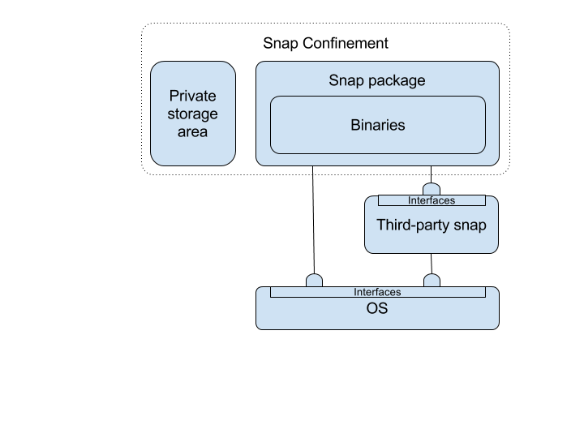

# The snapd system

In traditional Linux distributions, software is made available in packages:

- that rely on the availability of services in the OS or other software.
- whose data isn't confined, so can be accessed by other software.
- that can be detrimentally effected by a system or software upgrade.
- that are complex to uninstall or downgrade.
- rely on a small number of approved 'packagers' to add them to the distro repositories.

Creating and distributing software can therefore be a time consuming process and the end result doesn't offer the user a high degree of security and manageability. 

The snapd system aims to fix these challenges by offering:

- System components and applications as self contained (except for the most basic OS features, such as network access), read only images, called snaps.
- A confinement and security model that:
  - Offers snaps a secure storage area isolated from other snaps.
  - Enables snaps to make features available to other snaps and for other snaps to consume those features over defined interfaces.
  - A store where developers can easily make their software directly available to users and from which devices can automatically pull updates on a daily basis.
- A simple transactional update system where snaps can be easily uninstalled (by deleting the snap package) or rolled back (by reverting to the previous snap image and private storage area). 

On a snapd system these features are implemented by:

- **snapd**, a management environment that handles installing and updating snaps using the transactional system, as well as [garbage collection](/docs/concepts/versions) of old versions of snaps.
- **snapd-confine**, an execution environment for the applications and services delivered in snap packages.

The snapd system simplifies the development of devices and their software because, with the exception of a [limited number of OS features](/docs/concepts/core-classic "Components in Ubuntu core"), you're in control of all the components in your application. You simply add everything needed to the snap package. You then make the snap available using [the store](/docs/concepts/store "the store"), or, if you are the device creator, create your own store. 
