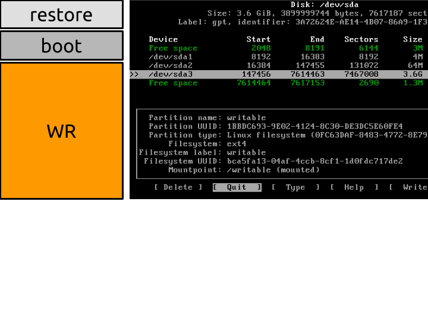

Title: Transactional Updates
# Transactional Updates
The system for transactional updates has been much simplified in Ubuntu Core Series 16, replacing dual partition with a bootloader that is able to load n system images.

## Partition Layout
The partition layout on snappy Ubuntu Core 16 has the following structure:

This partition layout introduces a significant change from the previous release as it no longer use a dual partition schema for the system.

## Updating the System (Kernel, OS and Gadget snaps)
Sequence for updating the system:

1. Run `$ sudo snappy update`.
1. The device downloads the update Kernel, OS and/or Gadget snaps from the store.
1. The previous versions of the snaps are moved to *restore* partition and the updated snaps are loaded to *boot* partition (writeable area copied in the same way?)
1. The device is rebooted.

If the system updates work as expected the device restarts and follows its defined boot process. However, if the boot process fails the system (automatically?) roll back to the previous image by:

1. Copying the previous versions of the Kernel, OS or Gadget snaps from the *restore* to the *boot* partition (overwriting the 'bad' snaps).
2. Rebooting the device.  

## Updating Application Snaps
The process for updating application snaps is similar, except that a device reboot isn't required to complete the update (unless the snap is a service?)
The sequence for updating an application snap is:

1. Run `$ sudo snappy update`.
1. The device downloads the updated snap from the store.
2. If the snap is being run by a daemon (as service) the daemon is stopped (what about running apps/command?).
2. The updated snap is identified as the current snap (how?).
3. A copy of the snap's writable data is taken and associated with the new 'current' snap
4. The snap's daemon (if any) is restated.

As noted if the snap is a service its automatically restarted, otherwise the new snap becomes available when the user executes one of its commands.

If there are issue with the updated snap then the previous version is restores simply by referring the system back to the previous snap file and writable area (how)?